# Social Marketing Pipeline — Architecture

```mermaid
flowchart TD
    %% ── Styles ──────────────────────────────────────────────────────────────
    classDef trigger   fill:#1a3324,stroke:#17e86b,color:#fff,stroke-width:2px
    classDef script    fill:#244732,stroke:#17e86b,color:#fff,stroke-width:2px
    classDef external  fill:#1e2a20,stroke:#0ea64c,color:#ccc,stroke-width:1px,stroke-dasharray:4 3
    classDef store     fill:#112117,stroke:#f97316,color:#fff,stroke-width:2px
    classDef platform  fill:#1a1a2e,stroke:#6366f1,color:#fff,stroke-width:2px
    classDef decision  fill:#2d1a00,stroke:#f97316,color:#fff,stroke-width:2px

    %% ════════════════════════════════════════════════════════════════════════
    %% LANE A  — Weekly population (cron)
    %% ════════════════════════════════════════════════════════════════════════

    subgraph POPULATE ["🗓  populate-weekly-calendar.js  (runs every Monday 08:00)"]
        direction TB
        CRON["⏰ Cron trigger\n0 8 * * 1"]:::trigger
        POP["populate-weekly-calendar.js"]:::script

        subgraph GEMINI_BLOCK ["Gemini  +  Google Search grounding"]
            direction LR
            GSEARCH["🔍 Google Search\n(recent news &amp; trends)"]:::external
            GEMINI["🤖 Gemini LLM\ngemini-2.0-flash\n\n• fintech news\n• travel trends\n• lifestyle moments\n• seasonal events"]:::external
        end

        PARSE["Parse JSON response\n(3–7 post objects)"]:::script
        DUPCHECK{"Duplicate\ndate check"}:::decision
        APPEND["Append rows to sheet\nweek_number · week_start\nscheduled_date · day_of_week\nprompt · caption · hashtags\nplatforms · news_hook"]:::script
    end

    CRON --> POP
    POP --> GSEARCH
    GSEARCH -->|"search results\n+ citations"| GEMINI
    GEMINI -->|"JSON array\nof posts"| PARSE
    PARSE --> DUPCHECK
    DUPCHECK -->|"new date"| APPEND
    DUPCHECK -->|"already exists"| SKIP["⚠ skip row"]:::decision

    %% ════════════════════════════════════════════════════════════════════════
    %% CENTRAL STORE
    %% ════════════════════════════════════════════════════════════════════════

    SHEET[("📊 Google Spreadsheet\nWeekly Content Calendar\n\nweek_number · week_start\nscheduled_date · day_of_week\nprompt · caption · hashtags\nplatforms · news_hook\nposted · posted_at\nimage_url · error")]:::store

    APPEND -->|"Google Sheets API\n(service-account OAuth2)"| SHEET

    %% ════════════════════════════════════════════════════════════════════════
    %% LANE B  — Posting (manual / cron)
    %% ════════════════════════════════════════════════════════════════════════

    subgraph POST ["📣  social-poster-script.js  (--today · --this-week · --week n)"]
        direction TB
        TRIGGER["▶ Manual trigger\nor separate cron"]:::trigger
        POSTER["social-poster-script.js"]:::script
        READ["Read &amp; filter rows\n--today / --this-week\n--week / --day / --date"]:::script
        CAL["🗓 Print weekly\ncalendar table"]:::script

        subgraph FOR_EACH ["For each pending post"]
            direction TB
            NB["🍌 Nano Banana API\nPOST modelInputs\n1080×1080 · 30 steps"]:::external
            IMG_URL["Public image URL"]:::script

            subgraph PUBLISH ["Publish to platforms"]
                direction LR
                IG_C["📸 Instagram\nCreate media container"]:::platform
                IG_P["✅ Instagram\nPublish container\n(+4s wait)"]:::platform
                FB["👍 Facebook Page\nPOST /photos"]:::platform
            end

            WRITEBACK["Write back to sheet\nposted=yes · posted_at\nimage_url · error"]:::script
        end
    end

    TRIGGER --> POSTER
    POSTER -->|"Google Sheets API\n(API key read)"| SHEET
    SHEET -->|"pending rows"| READ
    READ --> CAL
    CAL --> NB
    NB -->|"imageUrl"| IMG_URL
    IMG_URL --> IG_C
    IMG_URL --> FB
    IG_C -->|"container_id"| IG_P
    IG_P -->|"post_id"| WRITEBACK
    FB -->|"post_id"| WRITEBACK
    WRITEBACK -->|"Google Sheets API\n(service-account OAuth2)"| SHEET

    %% ════════════════════════════════════════════════════════════════════════
    %% FACEBOOK GRAPH API boundary
    %% ════════════════════════════════════════════════════════════════════════

    subgraph GRAPH ["Facebook Graph API  v19.0"]
        IG_C
        IG_P
        FB
    end

    %% ════════════════════════════════════════════════════════════════════════
    %% CLI flags legend
    %% ════════════════════════════════════════════════════════════════════════

    subgraph FLAGS ["CLI flags"]
        direction LR
        F1["populate-weekly-calendar.js\n--next-week (default)\n--this-week\n--week &lt;n&gt;\n--posts &lt;n&gt;\n--dry-run"]:::script
        F2["social-poster-script.js\n--today\n--this-week (default)\n--week &lt;n&gt;\n--day &lt;name&gt;\n--date YYYY-MM-DD\n--calendar (view only)\n--dry-run\n--include-posted"]:::script
    end
```

---

## Data flow summary

| Step | Script | Direction | Service |
|------|--------|-----------|---------|
| 1. Cron fires Monday 08:00 | `populate-weekly-calendar.js` | → | Gemini API |
| 2. Gemini searches the web | Gemini | ↔ | Google Search |
| 3. LLM generates post JSON | Gemini | → | script |
| 4. Rows appended | script | → | Google Spreadsheet |
| 5. Poster script reads rows | `social-poster-script.js` | ← | Google Spreadsheet |
| 6. Image generated | script | → | Nano Banana API |
| 7. Posted to Instagram | script | → | Facebook Graph API |
| 8. Posted to Facebook | script | → | Facebook Graph API |
| 9. Status written back | script | → | Google Spreadsheet |

## Environment variables

| Variable | Used by | Purpose |
|----------|---------|---------|
| `GEMINI_API_KEY` | populate | Gemini LLM + Search |
| `GEMINI_MODEL` | populate | Model ID (default: `gemini-2.0-flash`) |
| `GOOGLE_SHEETS_API_KEY` | both | Read access to sheet |
| `GOOGLE_SPREADSHEET_ID` | both | Target spreadsheet |
| `GOOGLE_SHEET_NAME` | both | Tab name (default: `Sheet1`) |
| `GOOGLE_SERVICE_ACCOUNT_JSON` | both | Write-back OAuth2 |
| `NANO_BANANA_API_KEY` | poster | Image generation auth |
| `NANO_BANANA_MODEL_KEY` | poster | Model / pipeline ID |
| `NANO_BANANA_API_URL` | poster | Inference endpoint |
| `FACEBOOK_ACCESS_TOKEN` | poster | Long-lived Page token |
| `FACEBOOK_PAGE_ID` | poster | Facebook Page |
| `INSTAGRAM_USER_ID` | poster | Instagram Business account |
